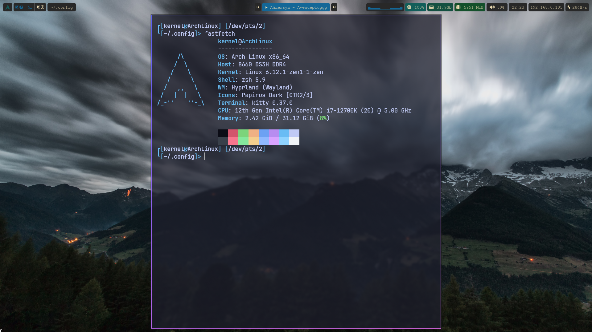
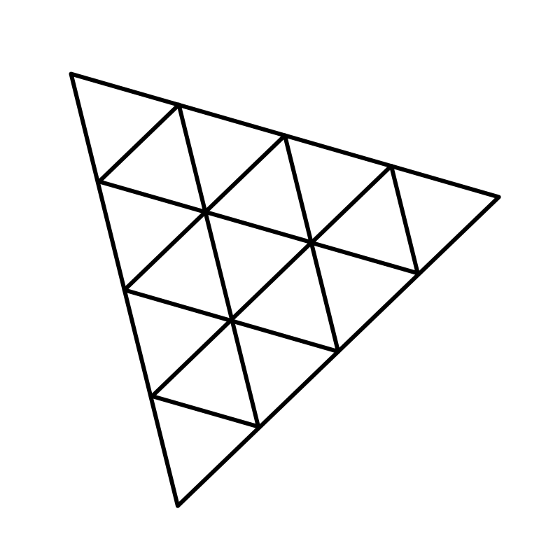
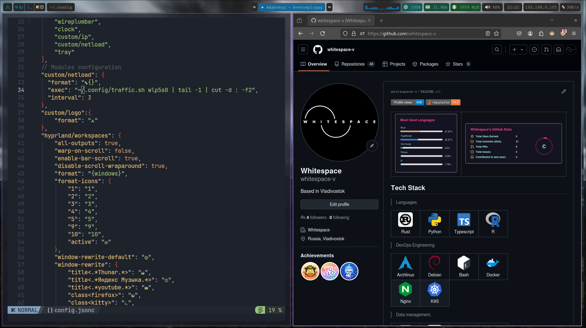

  
  
  
  

<table frame="none">
  <tr colsep="0">
    <td rowsep="0">
      
     </td>
     <td rowsep="0">
      
    </td>
  </tr>
</table>

<h2 align="left" id="whitespace-v-tech">Tech Stack</h2>

> Languages.

<table>
  <tr>
    <td align="center" width="96">
      
       Rust
    </td>
    <td align="center" width="96">
      
       Python
    </td>
    <td align="center" width="96">
      
       Typescript
    </td>
    <td align="center" width="96">
      
       R
    </td>
  </tr>
</table>

> DevOps.

<table>
 <tr>
    <td align="center" width="96">
      
       GitLab
    </td>
    <td align="center" width="96">
      
       GL runner
    </td>
    <td align="center" width="96">
      
       Grafana
    </td>
    <td align="center" width="96">
      
       Prometheus
    </td>
  </tr>
  <tr>
    <td align="center" width="96">
      
       Cron
    </td>
    <td align="center" width="96">
      
       ArgoCD
    </td>
    <td align="center" width="96">
      
       AlertManager
    </td>
    <td align="center" width="96">
      
       Bash
    </td>
  </tr>
  <tr>
    <td align="center" width="96">
      
       Blackbox
    </td>
    <td align="center" width="96">
      
       CertManager
    </td>
    <td align="center" width="96">
      
       Docker
    </td>
    <td align="center" width="96">
      
       K8S
    </td>
  </tr>
  <tr>
    <td align="center" width="96">
      
       Traefik
    </td>
    <td align="center" width="96">
      
       WireGuard
    </td>
    <td align="center" width="96">
      
       Loki
    </td>
    <td align="center" width="96">
      
       nginx
    </td>
  </tr>
  <tr>
    <td align="center" width="96">
      
       Ingress
    </td>
    <td align="center" width="96">
      
       Debian
    </td>
    <td align="center" width="96">
      
       ArchLinux
    </td>
    <td align="center" width="96">
      
       k3s
    </td>
  </tr>
</table>

> Data management

<table>
 <tr>
    <td align="center" width="96">
      
       Postgresql
    </td>
    <td align="center" width="96">
      
       Kafka
    </td>
    <td align="center" width="96">
      
       Redis
    </td>
    <td align="center" width="96">
      
       Prisma
    </td>
  </tr>
  <tr>
    <td align="center" width="96">
      
       SQL
    </td>
  </tr>
</table>

> Backend techs.

<table>
 <tr>
    <td align="center" width="96">
      
       Elysia
    </td>
    <td align="center" width="96">
      
       Nodejs
    </td>
    <td align="center" width="96">
      
       Flask
    </td>
    <td align="center" width="96">
      
       Actix
    </td>
  </tr>
  <tr>
    <td align="center" width="96">
      
       Tornado
    </td>
  </tr>
</table>

> Frontend techs.

<table>
 <tr>
    <td align="center" width="96">
      
       ReactJS
    </td>
    <td align="center" width="96">
      
       NextJS
    </td>
    <td align="center" width="96">
      
       Redux Toolkit
    </td>
    <td align="center" width="96">
      
       Jotai
    </td>
      </tr>
       <tr>
        <td align="center" width="96">
      
       Zustand
    </td>
    <td align="center" width="96">
      
       GSAP
    </td>
    <td align="center" width="96">
      
       Framer Motion
    </td>
    <td align="center" width="96">
      
       Three.js
    </td>
    </tr>
    <tr>
    <td align="center" width="96">
      
       Lottie
    </td>
        <td align="center" width="96">
      
       Vue
    </td>
  </tr>
</table>

